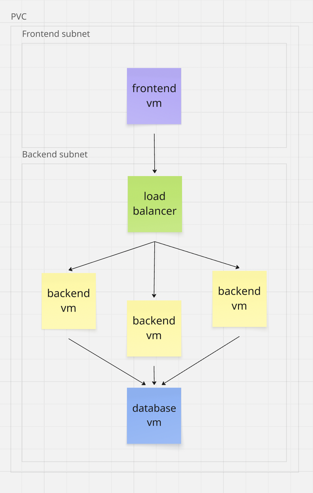

#### Внутри VPC выделены подсети для фронтенда и бекенда.

#### В подсети фронтенда живет одна виртуалка фронтенда, торчащая наружу через внешний IP.

#### В подсети бекенда живут балансировщик нагрузки, 3 виртуалки бекенда и виртуалка для БД.

#### Цикл жизни запроса: Клиент -> Фронтенд -> Балансировщик нагрузки -> Бекенд -> БД

